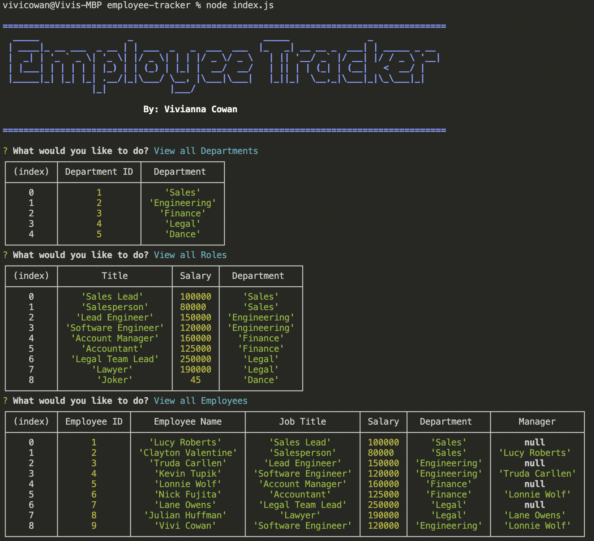
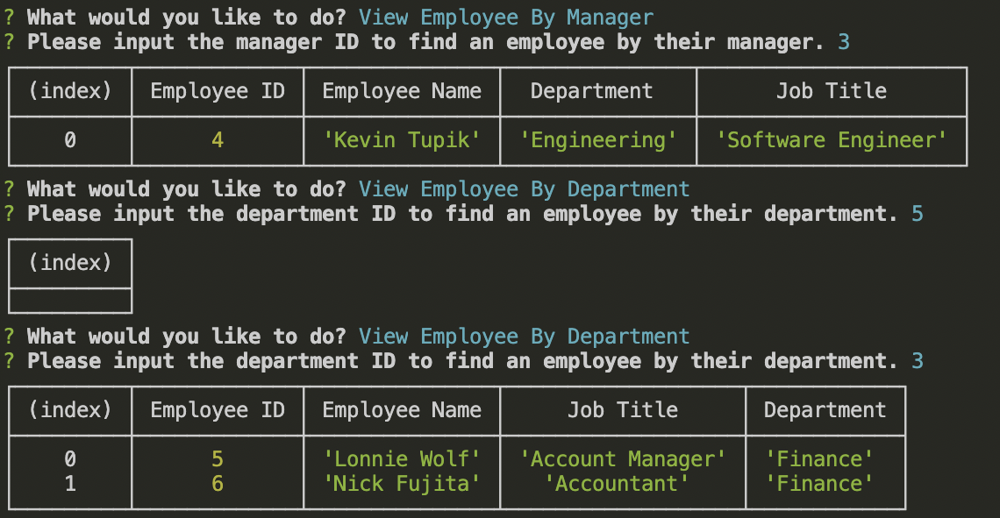

# Employee-Tracker

## Description:
- For this task, I wanted to allow a business owner to view and manage the departments, roles, and employees inside of a business.  
- The reason I built this employee traker was to get a better grasp of MySQL. I got to practice using a database, which can be very useful for me in the future.
- This task helped me gain a better understanding of the MySQL syntax and functionality. 

## How to run this application
- Employee Tracker is a command-line application. At the command line, type in "node index.js" to run the application.  The user will be presented with a series of questions related to the operations inside of a business. The user is to provide all needed information requested. If the user would like to add or update information, the information is stored inside the database and can be retrieved when requesting to view the information again.
- Before running "node index.js," the user must run "npm i" to make sure all npm and node modules are installed.

## Instuctional Video
For a demonstration on how to run this application, please watch this video: [Employee Tracker Walkthrough](https://www.youtube.com/watch?v=mMiwz-q80Jg)

## Images
Command Line:

Bonus Viewing:

